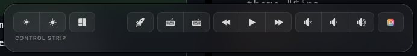
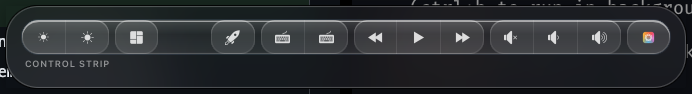
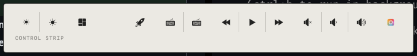
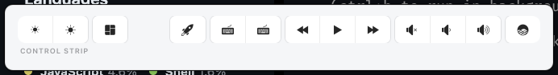
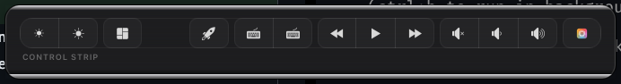
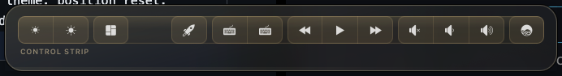
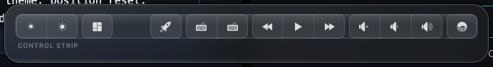
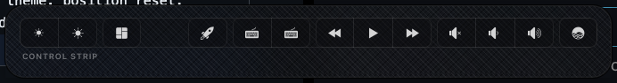

# Themes

Five selectable visual directions, picked in Preferences → Appearance →
Theme. Each owns both its native chrome (`PanelTheme.swift` — corner
radius, border) and its overlay look (`Resources/overlay/style.css`,
scoped under `body[data-theme="..."]`).

All five ship on `-apple-system` rather than the distinct Google Font each
one used in early exploration — loading a web font into the overlay would
put a network fetch on the critical path of "appear instantly when you
touch the Touch Bar," which this project otherwise keeps dependency-free.
Differentiation here comes from weight/case/spacing instead of family.

## Vapor

The default. Dark glass, soft glow, rounded — closest to Control Center's
own vibrancy.

## Meniscus

Heavily glassed: layered translucent gradients, a bigger glow radius, the
most "liquid" of the five.

## Ulm

Braun/Dieter Rams-inspired — flat, opaque, no gradients or shadows, a
single signal-red accent, monospace labels.

## Instrument

A shadcn-flavored light UI: white cards, a single indigo accent, flat
edges with a hairline border instead of a shadow.

## Unibody

Brushed-metal dark, inspired by Apple's own hardware finishes — a subtle
top-to-bottom gradient ground, inset hairline borders, a tiny precise LED
instead of a glowing dot.

## Special Themes

Material finishes on Vapor's own glass shape — same silhouette and blur,
different tint and a recolored dot — rather than new looks of their own.

### Vapor — Gold

Warm brass-tinted glass, amber glow.

### Vapor — Silver

Cool platinum-tinted glass, white-chrome glow.

### Vapor — Carbon Fiber

A woven-carbon texture (two crossed diagonal gradients) on the glass, with
a red accent.

---

These started as a five-way design exploration comparing glassmorphism and
Braun-inspired directions before being built for real and wired into
Preferences — see [`PanelTheme.swift`](../Sources/GhostBar/PanelTheme.swift).
